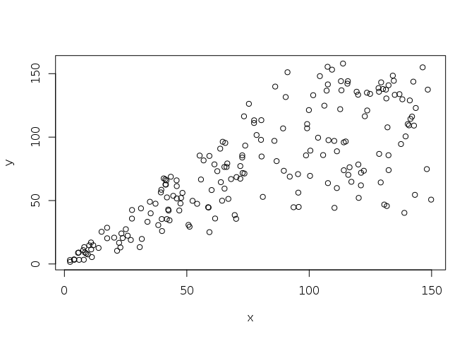
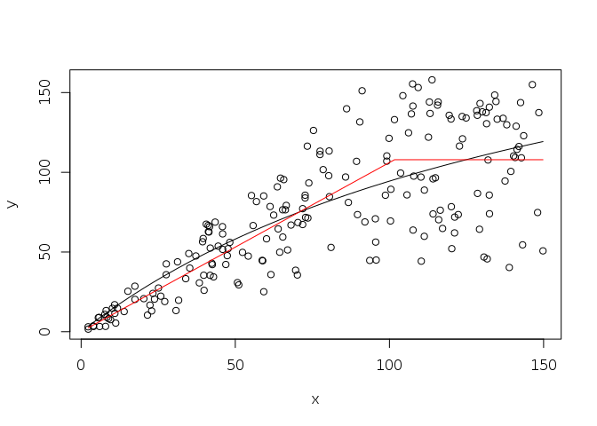

# Hockey Stick vs Beverton-Holt model results


### Recruitment Functions


```r
### Hockey-Stick Recruitment function
  HS = function(s, pars, n){
    r = pars[1]; k = pars[2]; 
    x = cbind( (1+r)*s, rep(k,n) )
    y = apply( x, 1, min )
    return(y)
  }

### Beverton-Holt function
  BH = function(s, pars){
    r = pars[1]; k = pars[2];
    y = (1+r)*s / (1 + r*s/k)
    return(y)
  }
```


### Generate Data from Hockey Stick 

(using uniform noise, note lognormal commented out)


```r
  #parameters
    rho = 1       #discrete discount factor
    r = 0.05      #growth rate
    k = 100       #carying capacity
    sig = .4      #std of normal rv (for lognormal rvs)
    m = -.5*sig^2 #mean of normal rv such that lognomormal has mean 1
    n = 200       #number of data points
    parms = c(r,k)
  
  #data (x = escapement, y = recruitment, z = random variable)
    x = runif(n,0,1.5*k)
    #z = rlnorm(n,meanlog = m, sdlog = sig)
    z = runif(n, .4,1.6)
    y = z*HS(x,parms,n)
  
  #plot data
    plot(x,y)
```

<!-- -->


### Fit Data to Beverton Holt


```r
  sseBH = function(p,x,y,n){
    yMod = BH(x,p)
    return( sum( (y-yMod)^2 ) )
  }

  sseHS = function(p,x,y,n){
    yMod = HS(x,p,n)
    return( sum( (y-yMod)^2 ) )
  }
  
  parInit = c(r,k)
  optOutBH = optim(parInit, fn = sseBH, x=x, y=y, n = n)
  optOutHS = optim(parInit, fn = sseHS, x=x, y=y, n = n)
  
  #plot fit
    plot(x,y)
    xSort = sort(x)
    lines( xSort, BH(xSort, optOutBH$par ) )
    lines( xSort, HS(xSort, optOutHS$par, n ), col ='red')
```

<!-- -->


### Calculate Optimal Escapements


```r
  rBH = optOutBH$par[1];
  kBH = optOutBH$par[2]; 
  
  rHS = optOutHS$par[1];
  kHS = optOutHS$par[2]; 
  
  OptEscBH = kBH/rBH*(sqrt(rho*(1+rBH)) -1)
  OptEscHS = kHS/(1+rHS)
```


Note the SSE is similar for both models: 1.2935457\times 10^{5} for the HS, and 1.3307856\times 10^{5} for the BH, even though optimal escapement is completely different: 101.6317107 for the HS, and 38.2309091 for BH.


### Test Escapement Strategies in a sum of harvest objective, deterministic


```r
## calculate the sum of harvest for fitted BH model    
  xBH=rep(NA,n+1)
  xBH[1]=k    
  objBH=0    
  for(i in 1:n){
    xBH[i+1] = HS(xBH[i], c(r, k), n=1)
    h = max(0, xBH[i+1] - OptEscBH)
    xBH[i+1] = xBH[i+1] - h
    objBH = objBH + h
  }    
  ObjBH = objBH + xBH[n+1] #take all fish at end

## calculate the sum of harvest for fitted HS model   
  xHS=rep(NA,n+1)
  xHS[1]=k    
  objHS=0    
  for(i in 1:n){
    xHS[i+1] = HS(xHS[i], c(r, k), n=1)
    h = max(0, xHS[i+1] - OptEscHS)
    xHS[i+1] = xHS[i+1] - h
    objHS = objHS + h
  }  
  objHS = objHS + xHS[n+1] #take all fish at end
  
## calculate the sum of harvest for perfect HS model   
  xHSp=rep(NA,n+1)
  xHSp[1]=k    
  objHSp=0    
  for(i in 1:n){
    xHSp[i+1] = HS(xHSp[i], c(r, k), n=1)
    h = max(0, xHSp[i+1] - k/(1+r))
    xHSp[i+1] = xHSp[i+1] - h
    objHSp = objHSp + h
  }  
  objHSp = objHSp + xHSp[n+1] #take all fish at end
```


## Results


The fitted BH objective is 442.1666363, fitted HS objective is 100.  Objective of true HS (parameters known) is 1047.6190476. Clearly the BH model, despite a comparably good fit, will dramatically over-harvest this stock.  

