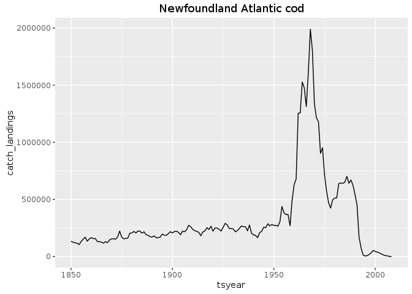
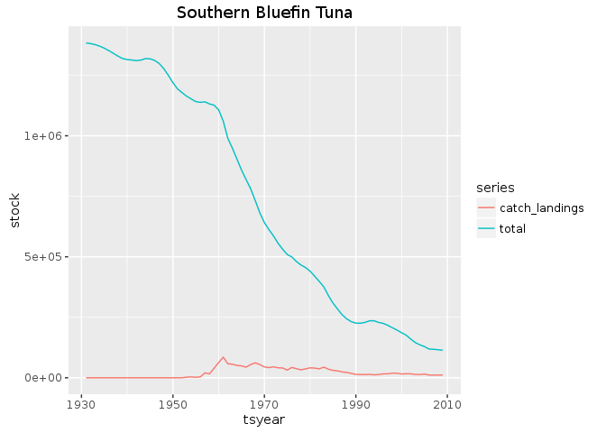

  
  

```r
library("ggplot2")
library("tidyr")
library("dplyr")
```


```r
values     <- read.csv("http://berkeley.carlboettiger.info/espm-88b/fish/data/values.csv")
assessment <- read.csv("http://berkeley.carlboettiger.info/espm-88b/fish/data/assessment.csv")
stock      <- read.csv("http://berkeley.carlboettiger.info/espm-88b/fish/data/stock.csv")
units      <- read.csv("http://berkeley.carlboettiger.info/espm-88b/fish/data/units.csv")
area       <- read.csv("http://berkeley.carlboettiger.info/espm-88b/fish/data/area.csv")
lmestock   <- read.csv("http://berkeley.carlboettiger.info/espm-88b/fish/data/lmestock.csv")
lmerefs    <- read.csv("http://berkeley.carlboettiger.info/espm-88b/fish/data/lmerefs.csv")
```


```r
tbl <-
  values %>%
  left_join(assessment) %>%
  left_join(stock) %>%
  left_join(units) %>%
  left_join(area) %>%
  left_join(lmestock) %>%
  left_join(lmerefs) %>%
  select(scientificname, commonname, tsyear, r, ssb, total, catch_landings, r_unit, ssb_unit, total_unit, catch_landings_unit, country, lme_name, lme_number, stockid, assessid)
```

```
## Joining, by = "assessid"
```

```
## Joining, by = "stockid"
```

```
## Joining, by = "assessid"
```

```
## Joining, by = "areaid"
```

```
## Joining, by = "stockid"
```

```
## Joining, by = "lme_number"
```


## Examples using Newfoundland Atlantic Cod 

Typically we consider the dynamics of all stocks of a given species in a given Large Marine Ecosystem (LME) as the relevant unit for ecological modeling and resource management.  Often this involves summing over multiple stock assessments and catch data, as such a species may be assessed and consumed by different reports and different countries.

`group_by` species, LME, and year allows us to aggregate catch, sock estimate, and so forth over the potentially multiple stock assessments. Some care must be taken in doing so not to average numbers measured in different units (e.g. metric tons, `MT`, vs thousands of fish, `E03`)

For instance, the famous Atlantic Cod timeseries is comprised over several stock assessments that cover the Grand Banks on the Newfoundland-Labrador Shelf LME, with overlapping time windows:


```r
tbl %>%
  filter(lme_name == "Newfoundland-Labrador Shelf") %>%
  filter(commonname == "Atlantic cod") %>%
  select(country, stockid, assessid, catch_landings_unit, lme_name) %>%
  distinct()
```

```
##         country    stockid                                  assessid
## 1        Canada   COD2J3KL        DFO-NFLD-COD2J3KL-1850-2005-RICARD
## 2        Canada COD2J3KLIS DFO-NFLD-COD2J3KLIS-1959-2006-PREFONTAINE
## 3        Canada     COD3Ps     DFO-NFLD-COD3Ps-1959-2004-PREFONTAINE
## 4        Canada  COD3Pn4RS   DFO-QUE-COD3Pn4RS-1964-2007-PREFONTAINE
## 5 multinational     COD3NO             NAFO-SC-COD3NO-1953-2007-BAUM
## 6 multinational      COD3M              NAFO-SC-COD3M-1959-2008-BAUM
##   catch_landings_unit                    lme_name
## 1                  MT Newfoundland-Labrador Shelf
## 2                  MT Newfoundland-Labrador Shelf
## 3                  MT Newfoundland-Labrador Shelf
## 4                  MT Newfoundland-Labrador Shelf
## 5                  MT Newfoundland-Labrador Shelf
## 6                  MT Newfoundland-Labrador Shelf
```

Consequently we want to sum over concurrent assessments to get the stock totals (`group_by` and `summarize_at` let us do this for all species-lme pairs simultaneously):


```r
tbl %>%
  filter(catch_landings_unit == 'MT') %>%
  group_by(commonname, lme_name, tsyear) %>%
  summarise_at(vars(catch_landings, total), sum, na.rm=TRUE) %>%
  filter(lme_name == "Newfoundland-Labrador Shelf") %>%
  filter(commonname == "Atlantic cod") %>%
  ggplot(aes(tsyear, catch_landings)) + geom_line() + ggtitle("Newfoundland Atlantic cod") 
```

<!-- -->


In other species, such as the sought-after Southern bluefin tuna (a single fish can sell for over 1 million USD), the species range spans several LME areas, covered by a single assessment:


```r
tbl %>%
  filter(commonname == "Southern bluefin tuna") %>% 
  select(country, stockid, assessid, catch_landings_unit, lme_name) %>%
  distinct()
```

```
##         country stockid                     assessid catch_landings_unit
## 1 multinational     SBT CCSBT-SC-SBT-1931-2009-Parma                  MT
## 2 multinational     SBT CCSBT-SC-SBT-1931-2009-Parma                  MT
## 3 multinational     SBT CCSBT-SC-SBT-1931-2009-Parma                  MT
##             lme_name
## 1   Indian High Seas
## 2  Pacific High Seas
## 3 Atlantic High Seas
```


```r
tbl %>%
  filter(catch_landings_unit == 'MT') %>%
  group_by(commonname, lme_name, tsyear) %>%
  summarise_at(vars(catch_landings, total), sum, na.rm=TRUE) %>%
  filter(commonname == "Southern bluefin tuna") %>% 
  gather(series, stock, -tsyear, -commonname, -lme_name) %>%
  ggplot(aes(tsyear, stock, col=series)) + geom_line() + ggtitle("Southern Bluefin Tuna") 
```

<!-- -->


