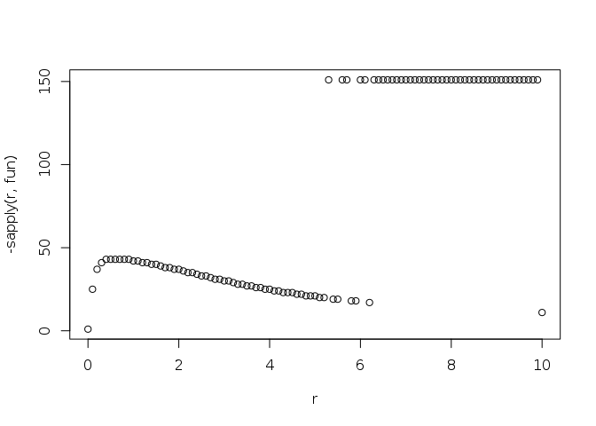
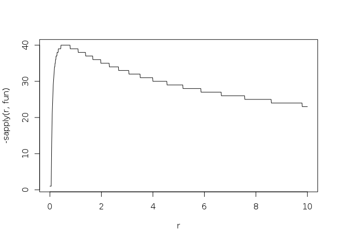

# Epsilon Harvest Puzzle

Can 1-D stock-recruitment models be reconciled with optimal harvests that are only a small percent of the total stock size?  

What parameter values of a 1-D harvest model such as Ricker or Beverton-Holt result in an optimal harvest that is only $\epsilon \cdot K$ for an unharvested equilibrium of $K$ and arbitrary (small) $\epsilon$?

Here we set up the basic optimization problem:


```r
states <- 0:150 # Vector of all possible states
actions <- states   # Vector of actions: harvest

## Deterministic skeleton of recruitment function (for transistion matrix)
ricker <- function(x, h, r = .2, K = 1e2){
  s <- pmax(x - h, 0)
  s * exp(r * (1 - s / K) )
}


bh <- function(x, h, r = 1, K = 100){
  S = x - h
  (1 + r) * S / (1 + r * S / K)
}


shepherd <- function(x, h, r = 1, K = 100, n = 1){
  (1 + r) * x / (1 + r * x^(1/n) / K ) - h
} 

myers <- function(x, h, r=1 ,K=100, delta = 1){
  S = x - h
  (1+r) * S^delta / (1 + r * S^delta / K)
}

pt <- function(x, h, r, K, theta){
  x + ((1 + theta) / theta) * r * x * (1 - (x/K)^theta) - h
}

## lognormal log-sd parameter
sigma_g <- 0.01

# Reward function
reward_fn <- function(x,h) {
  pmin(x,h)
}

# Discount factor
discount <- 0.95

alpha <- discount 

alpha  <- (1 - discount) / discount

gamma <- 1 / (1 + alpha)
```

##  Exact / semi-analytic solution


Under small noise such that the self-sustaining condition is met, the optimal escapement $S^*$ is the same as in the deterministic case, 

$$f'(S^*) = \frac{1}{\alpha}$$

for growth rate $f$ and discount rate $\alpha$.  Thus given the derivative of the growth function we can easily determine the optimal escapement.  


```r
# Derivative of Ricker function:
ricker_prime <- function(x, r, K = 100) exp(r * (1 - x / K)) * (1 - r * x / K) 
# Derivative of Beverton-Holt
bh_prime = function(x, r, K = 100) K ^ 2 * (r + 1) / (K + r * x) ^ 2
```


### Ricker case

Let's start with the Ricker model:


```r
f <- ricker
f_prime <- ricker_prime
```


For a fixed $r$, e.g. $r = 0.1$ , we can just query what state $S$ gets $f'(S) - 1/ \alpha$ closest to zero:


```r
S_star = states[ which.min(abs(sapply(states, function(x) f_prime(x, r = 0.1) - 1 / discount))) ]
S_star
```

```
## [1] 24
```


```r
S_star = states[ which.min(abs(sapply(states, function(x) f_prime(x, r = 2) - 1 / discount))) ]
S_star
```

```
## [1] 36
```


What `r` results in the largest escapement?  We can just optimize on a range of `r` values between 0 and 10:


```r
fun <- function(r) -which.min(abs(sapply(states, function(x) f_prime(x, r = r) - 1 / discount  )))
out <- optimize(f = fun, interval = c(0,10))
r_star = out$minimum

## What is the corresponding optimal escapement?
S_star = states[ which.min(abs(sapply(states, function(x) f_prime(x, r = r_star) - 1 / discount))) ]
c(r_star = r_star, S_star = S_star)
```

```
##     r_star     S_star 
##  0.5573589 42.0000000
```

```r
r = seq(0,10, by=0.1)
plot(r, - sapply(r, fun))
```

<!-- -->

Hmm, Ricker cannot get a (deterministic) optimal escapement near K.  On the opposite side, note that we can get pretty small optimal escapement though. Here we solve for the value of `r` that results in the largest escapement:


```r
## What r results in the largest escapement?
fun <- function(r) which.min(abs(sapply(states, f_prime, r = r)))
out <- optimize(f = fun, interval = c(0,10))
out$minimum
```

```
## [1] 5.247662
```

### Beverton-Holt case


```r
fun <- function(r) -which.min(abs(sapply(states, function(x) bh_prime(x, r = r) - 1 / discount  )))
out <- optimize(f = fun, interval = c(0,10))
r_star = out$minimum

## What is the corresponding optimal escapement?
S_star = states[ which.min(abs(sapply(states, function(x) bh_prime(x, r = r_star) - 1 / discount))) ]
c(r_star = r_star, S_star = S_star)
```

```
##     r_star     S_star 
##  0.5573423 39.0000000
```

```r
r = seq(0,10, by=0.01)
plot(r, - sapply(r, fun), type = 'l')

rho = (1 - discount) / discount # rho = 1 implies full discount, no escapement.  

#curve(100 * ( sqrt( (1+x) / (1 + rho)  ) - 1 ), 0, 10, add=TRUE)
curve( (100 / x) * (sqrt( 0.05 * (1 + x)) - 1) , 0, 10, add = TRUE)
```

<!-- -->


## Solution for generic $f$

In general we can optimize instead of taking an analytic derivative: 


```r
find_S_star <- function(f, discount){
  fun <- function(x) x / discount - f(x,0)
  out <- optimize(f = fun, interval = c(min(states),max(states)))
  ceiling(out$minimum)
}

find_S_star(function(x,h) ricker(x,h, r = 1, K = 100), discount)
```

```
## [1] 42
```

```r
find_S_star(function(x,h) bh(x,h, r = 1, K = 100), discount)
```

```
## [1] 38
```

```r
find_S_star(function(x,h) ricker(x,h, r = .55, K = 100), discount)
```

```
## [1] 43
```

```r
find_S_star(function(x,h) bh(x,h, r = 6, K = 100), discount)
```

```
## [1] 27
```

(We use ceiling as S* not on grid, so adjust. round, since we're on an integer grid anyhow). 


## Other functional forms


```r
find_S_star(function(x,h) shepherd(x,h, r = 2, K = 100,  n = 1/2), discount)
```

```
## [1] 5
```


```r
find_S_star(function(x,h) myers(x,h, r = .4, K = 100,  2), discount)
```

```
## [1] 52
```


```r
find_S_star(function(x,h) pt(x,h, r = 3, K = 100,  .5), discount)
```

```
## [1] 44
```

## Comparison to numerical solution


Numeric SDP solution (for stochastic dynamics)


```r
numeric_S_star <- function(f, states, actions, sigma_g, discount){

# Initialize
n_s <- length(states)
n_a <- length(actions)
transition <- array(0, dim = c(n_s, n_s, n_a))
reward <- array(0, dim = c(n_s, n_a))

# Fill in the transition and reward matrix, Looping over all states & actions
for (k in 1:n_s) {
  # Loop on all actions
  for (i in 1:n_a) {
    # Calculate the transition state at the next step, given the
    # current state k and the harvest actions[i]
    nextpop <- f(states[k], actions[i])
    if(nextpop <= 0)
      transition[k, , i] <- c(1, rep(0, n_s - 1))
    # Implement stochasticity by drawing probability from a density function
    else if(sigma_g > 0){
      x <- dlnorm(states, log(nextpop), sdlog = sigma_g)    # transition probability densities
      N <- plnorm(states[n_s], log(nextpop), sigma_g)       # CDF accounts for prob density beyond boundary
      x <- x * N / sum(x)                                   # normalize densities to  = cdf(boundary)
      x[n_s] <- 1 - N + x[n_s]                              # pile remaining probability on boundary
      transition[k, , i] <- x                             # store as row of transition matrix
    } else {
     stop("sigma_g not > 0")
    }
    # Compute reward matrix
    reward[k, i] <- reward_fn(states[k], actions[i])
  } # end of action loop
} # end of state loop

mdp <- MDPtoolbox::mdp_policy_iteration(transition, reward, discount)

policy <- states - actions[mdp$policy]
S_star <- max(policy)
S_star
}
```


## Ricker


```r
f <- function(x,h) ricker(x, h, r = 0.55, K = 100)
numeric_S_star(f, states = states, actions = actions, sigma_g = sigma_g, discount = discount)
```

```
## Note: method with signature 'Matrix#matrix' chosen for function '-',
##  target signature 'ddiMatrix#matrix'.
##  "ddiMatrix#ANY" would also be valid
```

```
## Note: method with signature 'ddiMatrix#dMatrix' chosen for function '-',
##  target signature 'ddiMatrix#dtCMatrix'.
##  "diagonalMatrix#triangularMatrix" would also be valid
```

```
## [1] 42
```

```r
find_S_star(f, discount)
```

```
## [1] 43
```


```r
f <- function(x,h) ricker(x, h, r = 3, K = 100)
numeric_S_star(f, states = states, actions = actions, sigma_g = sigma_g, discount = discount)
```

```
## [1] 11
```

```r
find_S_star(f, discount)
```

```
## [1] 30
```

Though for small r, numeric `S_star` is much lower!


```r
f <- function(x,h) ricker(x, h, r = .1, K = 100)
numeric_S_star(f, states = states, actions = actions, sigma_g = sigma_g, discount = discount)
```

```
## [1] 19
```

```r
find_S_star(f, discount)
```

```
## [1] 25
```


## Beverton-Holt


```r
f <- function(x,h) bh(x, h, r = .5, K = 100)
numeric_S_star(f, states = states, actions = actions, sigma_g = sigma_g, discount = discount)
```

```
## [1] 37
```

```r
find_S_star(f, discount)
```

```
## [1] 39
```


```r
f <- function(x,h) bh(x, h, r = 1, K = 100)
numeric_S_star(f, states = states, actions = actions, sigma_g = sigma_g, discount = discount)
```

```
## [1] 38
```

```r
find_S_star(f, discount)
```

```
## [1] 38
```


```r
f <- function(x,h) bh(x, h, r = 2.7, K = 100)
numeric_S_star(f, states = states, actions = actions, sigma_g = sigma_g, discount = discount)
```

```
## [1] 22
```

```r
find_S_star(f, discount)
```

```
## [1] 33
```


```r
f <- function(x,h) bh(x, h, r = 6, K = 100)
numeric_S_star(f, states = states, actions = actions, sigma_g = sigma_g, discount = discount)
```

```
## [1] 26
```

```r
find_S_star(f, discount)
```

```
## [1] 27
```

